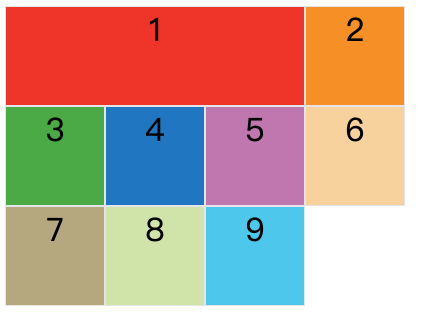
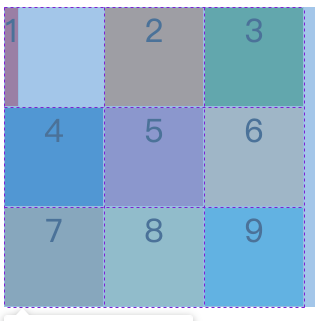

## Grid网格布局

网格布局（Grid）是最强大的 CSS 布局方案。

它将网页划分成一个个网格，可以任意组合不同的网格，做出各种各样的布局。以前，只能通过复杂的 CSS 框架达到的效果，现在浏览器内置了。


上图就是网格布局的拿手好戏。

Grid 布局与 [Flex 布局](https://www.ruanyifeng.com/blog/2015/07/flex-grammar.html)有一定的相似性，都可以指定容器内部多个项目的位置。但是，它们也存在重大区别。

Flex 布局是轴线布局，只能指定"项目"针对轴线的位置，可以看作是**一维布局**。Grid 布局则是将容器划分成"行"和"列"，产生单元格，然后指定"项目所在"的单元格，可以看作是**二维布局**。Grid 布局远比 Flex 布局强大。


### 基础概念

Grid网格布局主要有几个基础概念：行和列、单元格、网格线


水平区域称为"行"（row），垂直区域称为"列"（column）。

行和列的交叉区域，称为"单元格"（cell）。正常情况下，`n`行和`m`列会产生`n x m`个单元格。比如，3行3列会产生9个单元格。

划分网格的线，称为"网格线"（grid line）。图中绿色表示网格线。

水平网格线划分出行，垂直网格线划分出列。正常情况下，`n`行有`n + 1`根水平网格线，`m`列有`m + 1`根垂直网格线，比如三行就有四根水平网格线。


### 容器属性

##### 1、display: grid;

指定一个容器采用网格布局。

```css
.container {
  display: grid;
}
```


默认情况下，容器元素都是块级元素，但也可以设成行内元素。

```css
.container {
  display: inline-grid;
}
```


上图是`display: inline-grid`的[效果](https://jsbin.com/qatitav/edit?html,css,output)。

> 注意，设为网格布局以后，容器子元素的`float`、`display: inline-block`、`display: table-cell`、`vertical-align`和`column-*`等设置都将失效。


##### 2、grid-template-columns属性和grid-template-rows 属性

容器指定了网格布局以后，接着就要划分行和列。`grid-template-columns`属性定义每一列的列宽，`grid-template-rows`属性定义每一行的行高。

```css
.container {
  display: grid;
  grid-template-columns: 100px 100px 100px;
  grid-template-rows: 100px 100px 100px;
}
```

上面代码指定了3*3的网格；列宽和行高都是`100px`。


除了可以使用px单位外，还可以使用百分比%

```css
.container {
  display: grid;
  grid-template-columns: 33.33% 33.33% 33.33%;
  grid-template-rows: 33.33% 33.33% 33.33%;
}
```


###### （1）repeat()

有时候，重复写同样的值非常麻烦，尤其网格很多时。这时，可以使用`repeat()`函数，简化重复的值。上面的代码用`repeat()`改写如下。

```css
.container {
  display: grid;
  grid-template-columns: repeat(3, 33.33%);
  grid-template-rows: repeat(3, 33.33%);
}
```

`repeat()`接受两个参数，第一个参数是重复的次数（上例是3），第二个参数是所要重复的值。

`repeat()`重复某种模式也是可以的。

```css
.container {
  grid-template-columns: repeat(2, 110px 30px 80px);
}
```

上面代码定义了6列，第一列和第四列的宽度为100px，第二列和第五列为20px，第三列和第六列为80px。


###### （2）auto-fill 关键字

有时，单元格的大小是固定的，但是容器的大小不确定。如果希望每一行（或每一列）容纳尽可能多的单元格，这时可以使用`auto-fill`关键字表示自动填充。

```css
.container {
  grid-template-columns: repeat(auto-fill, 100px);
}
```

上面定义了每列宽度`100px`，然后自动填充，直到容器不能放置更多的列。


###### （3）fr 关键字

为了方便表示比例关系，网格布局提供了`fr`关键字（fraction 的缩写，意为"片段"）。如果两列的宽度分别为`1fr`和`2fr`，就表示后者是前者的两倍。

```css
.container {
  grid-template-columns: 1fr 1fr;
}
```

上面代码表示了两列，两列的宽度都相同


`fr`可以与绝对长度的单位结合使用，这时会非常方便。

```css
.container {
  grid-template-columns: 200px 1fr 2fr;
}
```

上面代码表示了三列，第一列宽度为200px，第二列宽度是第三列的一半。


###### （4）minmax()

`minmax()`函数产生一个长度范围，表示长度就在这个范围之中。它接受两个参数，分别为最小值和最大值。

```css
.container {
  grid-template-columns: minmax(100px, 300px) minmax(200px, 1fr) 100px;
}
```

`minmax(100px, 300px)`表示最小100px，最大300px

###### （5）auto 关键字

`auto`关键字表示由浏览器自己决定长度。

```css
.container {
  grid-template-columns: 100px auto 100px;
}
```

上面代码中，第二列的宽度，基本上等于该列单元格的最大宽度，除非单元格内容设置了`min-width`，且这个值大于最大宽度。


##### 3、row-gap 属性， column-gap 属性， gap 属性

`row-gap`属性设置行与行的间隔（行间距），`column-gap`属性设置列与列的间隔（列间距）。

```css
.container {
  row-gap: 20px;
  column-gap: 10px;
}
```

上面代码中设置了行间隔20px，列间隔10px。


gap属性是row-gap和column-gap合并简写：

```css
.container {
  gap: <row-gap> <column-gap>;
}
```

因此上面代码可以写成：

```css
.container {
  gap: 20px 10px;
}
```

如果gap只写第一个值，默认第二个值跟第一个值相等。


##### 4、grid-auto-flow 属性

划分网格以后，容器的子元素会按照顺序，自动放置在每一个网格。默认的放置顺序是"先行后列"，即先填满第一行，再开始放入第二行，即下图数字的顺序。


这个顺序由`grid-auto-flow`属性决定，默认值是`row`，即"先行后列"。也可以将它设成`column`，变成"先列后行"。

```css
.container {
  grid-auto-flow: column;
}
```


`grid-auto-flow`属性除了设置成`row`和`column`，还可以设成`row dense`和`column dense`。这两个值主要用于，某些项目指定位置以后，剩下的项目怎么自动放置。

```css
.item-1 {
  grid-column-start: 1;
  grid-column-end: 3;
}
.item-2 {
  grid-column-start: 1;
  grid-column-end: 3;
}
```

上面让1号项目和2号项目各占据两个单元格，然后在默认的`grid-auto-flow: row`情况下，会产生下面这样的布局。（grid-column-start和grid-column-end是设置到子元素中的，下面会讲）。


上图中，1号项目后面的位置是空的，这是因为3号项目默认跟着2号项目，所以会排在2号项目后面。

现在修改设置，设为`row dense`，表示"先行后列"，并且尽可能紧密填满，尽量不出现空格。

```css
.container {
  grid-auto-flow: row dense;
}
```

效果如下：


上图会先填满第一行，再填满第二行，所以3号项目就会紧跟在1号项目的后面。8号项目和9号项目就会排到第四行。

如果将设置改为`column dense`，表示"先列后行"，并且尽量填满空格。

```css
.container {
  grid-auto-flow: column dense;
}
```

效果如下：


上图会先填满第一列，再填满第2列，所以3号项目在第一列，4号项目在第二列。8号项目和9号项目被挤到了第四列。


##### 5、 justify-items 属性， align-items 属性， place-items 属性

`justify-items`属性设置单元格内容的水平位置（左中右），`align-items`属性设置单元格内容的垂直位置（上中下）。

```css
.container {
  justify-items: start | end | center | stretch;
  align-items: start | end | center | stretch;
}
```

这两个属性的写法完全相同，都可以取下面这些值。

> - start：对齐单元格的起始边缘。
> - end：对齐单元格的结束边缘。
> - center：单元格内部居中。
> - stretch：拉伸，占满单元格的整个宽度（默认值）。

```css
.container {
  justify-items: start;
}
```

上面代码表示，单元格的内容左对齐，效果如下图。


```css
.container {
  align-items: start;
}
```

上面代码表示，单元格的内容头部对齐，效果如下图。


`place-items`属性是`align-items`属性和`justify-items`属性的合并简写形式。

```css
place-items: <align-items> <justify-items>;
```

```css
.container {
  place-items: start end;
}
```

如果只有一个值，默认第二值和第一个值相等

上面代码表示，单元格的内容右上对齐，效果如下图。


##### 6、justify-content 属性， align-content 属性， place-content 属性

`justify-content`属性是整个内容区域在容器里面的水平位置（左中右），`align-content`属性是整个内容区域的垂直位置（上中下）。

```css
.container {
  justify-content: start | end | center | stretch | space-around | space-between | space-evenly;
  align-content: start | end | center | stretch | space-around | space-between | space-evenly;  
}
```

这两个属性的写法完全相同，都可以取下面这些值：

> - start：对齐容器的起始边框。
> - end：对齐容器的结束边框。
> - center：容器内部居中。
> - stretch：拉伸，占满单元格的整个宽度（默认值）。
> - space-around：每个项目两侧的间隔相等。所以，项目之间的间隔比项目与容器边框的间隔大一倍。
> - space-between： 项目与项目的间隔相等，项目与容器边框之间没有间隔。
> - space-evenly：项目与项目的间隔相等，项目与容器边框之间也是同样长度的间隔。

```css
.container {
  justify-content: start; /* 对齐容器的起始边框。 */
}
```


```css
.container {
  justify-content: end; /* 容器内部居中。 */
}
```


```css
.container {
  justify-content: center; /* 对齐容器的结束边框。 */
}
```


```css
.container {
  justify-content: space-around; /* 每个项目两侧的间隔相等。所以，项目之间的间隔比项目与容器边框的间隔大一倍。 */
}
```


```css
.container {
  justify-content: space-between; /* 项目与项目的间隔相等，项目与容器边框之间没有间隔。 */
}
```


```css
.container {
  justify-content: space-evenly; /* 项目与项目的间隔相等，项目与容器边框之间也是同样长度的间隔。 */
}
```


align-content跟justify-content效果是一样的，只是把方向从水平变成了垂直。

`place-content`属性是`align-content`属性和`justify-content`属性的合并简写形式。

```css
place-content: <align-content> <justify-content>
```

```css
.container {
  place-content: space-around space-evenly;
}
```

如果只有一个值，默认第二个值跟第一个值相等


##### 7、grid-auto-columns 属性， grid-auto-rows 属性

有时候，一些项目的指定位置，在现有网格的外部。比如网格是3*2，但是项目却不止6个。这时，浏览器会自动生成多余的网格，以便放置项目。

`grid-auto-columns`属性和`grid-auto-rows`属性用来设置，浏览器自动创建的多余网格的列宽和行高。它们的写法与`grid-template-columns`和`grid-template-rows`完全相同。如果不指定这两个属性，浏览器完全根据单元格内容的大小，决定新增网格的列宽和行高。

```css
.container {
  display: grid;
  grid-template-columns: 100px 100px 100px;
  grid-template-rows: 100px 100px;
  grid-auto-rows: 80px;
}
```

上面代码指定了两行三列的网格，多余的网格指定80像素的高


### 项目属性（子元素属性）

##### 1、grid-column-start 属性， grid-column-end 属性， grid-row-start 属性， grid-row-end 属性

- 项目的位置是可以指定的，具体方法就是指定项目的四个边框，分别定位在哪根网格线。

  > - `grid-column-start`属性：左边框所在的垂直网格线
  > - `grid-column-end`属性：右边框所在的垂直网格线
  > - `grid-row-start`属性：上边框所在的水平网格线
  > - `grid-row-end`属性：下边框所在的水平网格线

```css
.item-1 {
  grid-column-start: 2;
  grid-column-end: 4;
}
```

上面代码指定，1号项目的左边框是第二根垂直网格线，右边框是第四根垂直网格线。


上图中，只指定了1号项目的左右边框，没有指定上下边框，所以会采用默认位置，即上边框是第一根水平网格线，下边框是第二根水平网格线。

除了1号项目以外，其他项目都没有指定位置，由浏览器自动布局，这时它们的位置由容器的`grid-auto-flow`属性决定，这个属性的默认值是`row`，因此会"先行后列"进行排列。

```css
.item-1 {
  grid-column-start: 1;
  grid-column-end: 3;
  grid-row-start: 2;
  grid-row-end: 4;
}
```


这四个属性的值，除了指定为第几个网格线，还可以指定为网格线的名字。

```css
.container {
  grid-template-columns: [c1] 100px [c2] 100px [c3] 100px [c4];
}
.item-1 {
  grid-column-start: c1;
  grid-column-end: c3;
}
```

上面代码中c1-c4表示网格线的名字，左边框和右边框的位置，都指定为网格线的名字。


这四个属性的值还可以使用`span`关键字，表示"跨越"，即左右边框（上下边框）之间跨越多少个网格。

```css
.item-1 {
  grid-column-start: span 3;
}
```

上面代码表示，1号项目的左边框距离右边框跨越3个网格。



这与下面的代码效果完全一样。

```css
.item-1 {
  grid-column-end: span 3;
}
```

使用这四个属性，如果产生了项目的重叠，则使用`z-index`属性指定项目的重叠顺序。


##### 2、grid-column 属性， grid-row 属性

`grid-column`属性是`grid-column-start`和`grid-column-end`的合并简写形；

`grid-row`属性是`grid-row-start`属性和`grid-row-end`的合并简写形式。

```css
.item {
  grid-column: <start-line> / <end-line>;
  grid-row: <start-line> / <end-line>;
}
```

```css

.item-1 {
  grid-column: 1 / 3;
  grid-row: 1 / 2;
}
/* 等同于 */
.item-1 {
  grid-column-start: 1;
  grid-column-end: 3;
  grid-row-start: 1;
  grid-row-end: 2;
}
```

上面代码中，项目`item-1`占据第一行，从第一根列线到第三根列线。

这两个属性之中，也可以使用`span`关键字，表示跨越多少个网格。

```css
.item-1 {
  grid-column: 1 / 3;
  grid-row: 1 / 3;
}
/* 等同于 */
.item-1 {
  grid-column: 1 / span 2;
  grid-row: 1 / span 2;
}
```


上面代码中，项目item-1占据的区域，包括第一行 + 第二行、第一列 + 第二列。

斜杠以及后面的部分可以省略，默认跨越一个网格。

```css
.item-1 {
  grid-column: 2;
  grid-row: 2;
}
```

上面代码中项目item-1位置是第二根列线和第二根行线，跨越一个网格。


##### 3、grid-area 属性

`grid-area`属性指定项目放在哪一个区域。

```css
.container {
  grid-template-areas:
          "a b c"
          "d e f"
          "g h i";
}
.item-1 {
  grid-area: d;
}
```

`grid-template-areas`是定义区域，即将三行三列的网格定义为a到i的九个区域

上面代码中，1号项目位于e区域，效果如下图。


`grid-area`属性还可用作`grid-row-start`、`grid-column-start`、`grid-row-end`、`grid-column-end`的合并简写形式，直接指定项目的位置。

```css
grid-area: <row-start> / <column-start> / <row-end> / <column-end>;
```

```css
.item-1 {
  grid-area: 1 / 2 / 3 / 3;
}
```


##### 4、justify-self 属性， align-self 属性， place-self 属性

`justify-self`属性设置单元格内容的水平位置（左中右），跟`justify-items`属性的用法完全一致，但只作用于单个项目。

`align-self`属性设置单元格内容的垂直位置（上中下），跟`align-items`属性的用法完全一致，也是只作用于单个项目。

> ```css
> .item {
>   justify-self: start | end | center | stretch;
>   align-self: start | end | center | stretch;
> }
> ```

这两个属性都可以取下面四个值。

> - start：对齐单元格的起始边缘。
> - end：对齐单元格的结束边缘。
> - center：单元格内部居中。
> - stretch：拉伸，占满单元格的整个宽度（默认值）。

```css
.item-1 {
  justify-self: start;
}
```



`place-self`属性是`align-self`属性和`justify-self`属性的合并简写形式。

> ```css
> place-self: <align-self> <justify-self>;
> ```

> ```css
> .item-1 {
>   place-self: center center;
> }
> ```

如果省略第二个值，`place-self`属性会认为这两个值相等。


